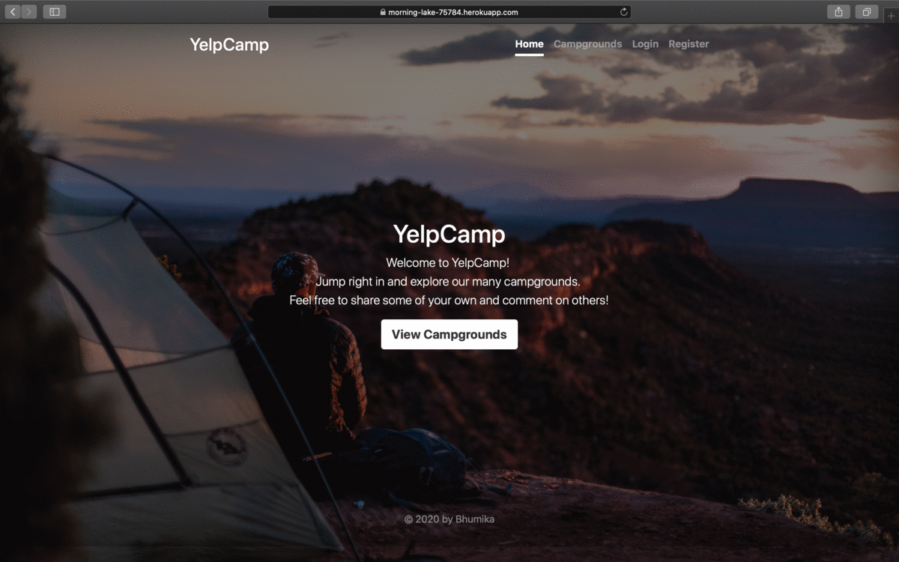

# YelpCamp

YelpCamp is a website where users can create and review campgrounds.
In order to review or create a campground, you must have an account.
This project was created using Node.js, Express, MongoDB, and Bootstrap.Passport.js was used to handle authentication. 
Yet to add clustermaps and other features.




## Advantages:

- Users can create, edit, and remove campgrounds or standard CRUD operations.
- Users can review campgrounds once, and edit or remove their review.
- User profiles include information of the user (full name, email), their campgrounds, and the option to edit their profile or delete their account


## To Run It Locally:
- Install mongodb.
- Create a cloudinary account to get an API key and secret code.Also mongodb atlas account to get database url.
- git clone https://github.com/bhumikakr/YelpCamp.git
- cd YelpCamp
- npm install node
- npm -init to create node_modules.
- Create a .env file in the root of the project and add the following:

```
SECRET=
CLOUDINARY_CLOUD_NAME= 
CLOUDINARY_KEY= 
CLOUDINARY_SECRET=
DB_URL=
MAPBOX_TOKEN=
```
- Run mongod in another terminal and node app.js or npx nodemon app.js in the terminal with the project.
- Then go to localhost:3000.
 
## Others:
 
 **Click on this link to see my project deployed on heroku: https://morning-lake-75784.herokuapp.com/**
